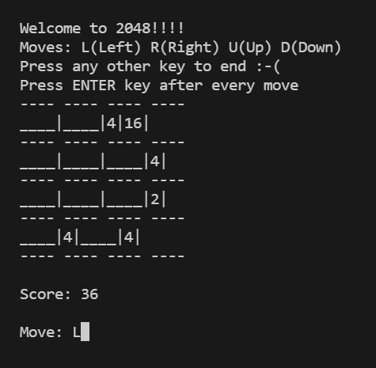

# 2048-Java

2048 game - CLI based - Java

## How to Run

1. Make sure you have **Java** installed in your system
2. Open **Command Prompt** in the root folder and run the command `cd src` to go the *src* folder.
3. To compile the code run the following commands in order:-
   1. `javac -d . Board.java`
   2. `javac -d . Game.java`
4. Run the command `java game2048.Game` to start playing

## How to Play

- It is a Command Line based game.
- Switch on the **Caps Lock** from your keyboard
- You have 4 possible move
  - **L** - Left
  - **R** - Right
  - **U** - Up
  - **D** - Down
- After pressing one of these keys, you need to press the **ENTER** key.
- The game ends when there are no possible more possible moves
- You can also end the game by pressing any other key and then pressing the **ENTER** key

## Rules

**2048** is played on a plain 4×4 grid, with numbered tiles that slide when a player moves them. Every turn, a new tile randomly appears in an empty spot on the board with a value of either 2 or 4. Tiles slide as far as possible in the chosen direction until they are stopped by either another tile or the edge of the grid. If two tiles of the same number collide while moving, they will merge into a tile with the total value of the two tiles that collided.The resulting tile cannot merge with another tile again in the same move.

If a move causes three consecutive tiles of the same value to slide together, only the two tiles farthest along the direction of motion will combine. If all four spaces in a row or column are filled with tiles of the same value, a move parallel to that row/column will combine the first two and last two. A scoreboard keeps track of the user's score. The user's score starts at zero, and is increased whenever two tiles combine, by the value of the new tile.

When the player has no legal moves (there are no empty spaces and no adjacent tiles with the same value), the game ends.
